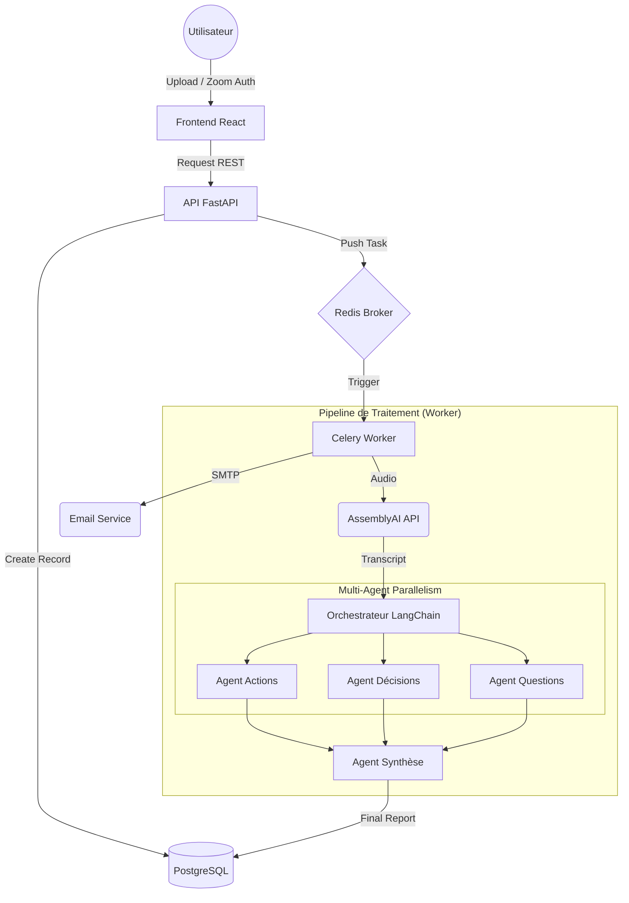

# 🚀 Guide de Préparation Entretien : Syntra.ai

Ce document est ton support complet pour maîtriser les aspects stratégiques et techniques du projet **Syntra.ai**.

---

## 🏗️ 1. Architecture Globale du Système

Pour briller en entretien, tu dois savoir expliquer comment les données circulent entre les différents composants.

### Schéma d'Architecture (Flux de données)

### Détails des Composants :
*   **Frontend (React + Tailwind)** : SPA (Single Page Application) gérant l'état de l'upload et l'affichage dynamique des rapports en Markdown.
*   **Backend (FastAPI)** : Utilise Pydantic pour la validation stricte des données et SQLAlchemy (Async) pour les interactions avec la base.
*   **Message Broker (Redis)** : Stockage temporaire des tâches. Choisi pour sa faible latence.
*   **Worker (Celery)** : Instance séparée qui exécute la logique métier lourde, permettant à l'API de rester disponible.

---

## 💻 2. Détails Techniques Approfondis (Deep Dive)

### A. Architecture Logicielle (Layered Architecture)
Le backend est organisé en couches pour respecter le principe de **Séparation des Responsabilités (SoC)** :
1.  **Routes (`/api`)** : Reçoivent les requêtes, valident les entrées avec Pydantic et appellent les services.
2.  **Services (`/services`)** : Contiennent la logique métier pure (calculs, appels API externes, orchestration).
3.  **Agents (`/agents`)** : Couche d'abstraction pour l'IA, contenant les `PromptTemplates` et la configuration des modèles.
4.  **Tasks (`/tasks`)** : Définissent les unités de travail asynchrones pour Celery.
5.  **Models (`/models`)** : Définition des schémas de base de données avec SQLAlchemy.

### B. Le Pipeline IA Multi-Agents (Le point fort technique)
L'implémentation utilise le concept de **Parallel Chain Extraction** :
*   **Input** : Un texte brut de transcription (souvent volumineux).
*   **Extraction Parallèle** : Au lieu d'un seul appel LLM coûteux et risqué, on utilise `asyncio.gather()`. 
    *   *Pourquoi ?* Pour éviter les timeouts et isoler les erreurs. Si l'agent "Décisions" échoue, les agents "Actions" et "Questions" peuvent toujours réussir.
*   **Aggregation** : L'agent de synthèse reçoit les sorties structurées des 3 agents précédents. Cela garantit un résumé final basé sur des faits extraits et non sur une interprétation globale floue.

### C. Gestion d'État et Robustesse
Chaque réunion passe par plusieurs états enregistrés en base de données (`status`) :
`PENDING` ➔ `UPLOADING` ➔ `TRANSCRIBING` ➔ `ANALYZING` ➔ `COMPLETED` / `FAILED`.
*   **Technique** : Cela permet de faire du **Polling** depuis le frontend ou d'utiliser des **Websockets** pour mettre à jour l'interface utilisateur en temps réel sans rafraîchissement.

---

## 🎬 3. Scénario de Démo (Impact Visuel)

1.  **L'Action** : "L'utilisateur upload un fichier MP4 de 30 minutes."
2.  **Le Temps Réel** : "Grâce à l'architecture asynchrone, l'utilisateur voit une barre de progression évoluer. Pendant ce temps, le worker Celery traite la transcription via AssemblyAI."
3.  **Le Résultat** : "Le rapport généré inclut la **diarisation** (ex: 'Jean : 40% du temps', 'Marie : 60%'). Les actions sont listées de manière précise."

---

## ❓ 4. Questions d'Entretien & Réponses Types

### Architecture & Backend
*   **Q : "Pourquoi PostgreSQL plutôt qu'une base NoSQL comme MongoDB ?"**
    *   **R** : "Pour la **consistance des données** et les relations fortes entre Utilisateurs, Réunions et Rapports. SQLAlchemy me permet de gérer ces relations de manière typée et sécurisée."
*   **Q : "Comment gérez-vous les échecs de transcription ?"**
    *   **R** : "Chaque tâche Celery est enveloppée dans un bloc `try/except`. En cas d'erreur API, le statut de la réunion passe à `FAILED` en base, et un message d'erreur clair est renvoyé au frontend."

### IA & LangChain
*   **Q : "Comment optimisez-vous le coût des tokens ?"**
    *   **R** : "En utilisant des modèles différents selon la tâche. Par exemple, un modèle plus léger pour l'extraction de faits simples et un modèle plus performant (comme GPT-4) uniquement pour la synthèse finale cohérente."
*   **Q : "C'est quoi la diarisation et pourquoi c'est important ?"**
    *   **R** : "C'est la capacité de l'IA à séparer les voix dans un seul flux audio. Sans ça, le résumé mélangerait les propos des différents participants, ce qui rendrait le compte-rendu inutilisable."

---

## ⚠️ 5. Analyse Critique (Points Faibles)

*   **Critique** : "L'upload de gros fichiers peut saturer votre bande passante serveur."
    *   **Réponse** : "C'est une limite actuelle. Pour une mise en production, j'utiliserais un **Presigned URL** pour uploader directement vers un bucket S3, déchargeant ainsi mon API FastAPI de la gestion du flux binaire."
*   **Critique** : "La dépendance aux APIs tierces est un risque."
    *   **Réponse** : "L'architecture est modulaire (Pattern Service). Remplacer AssemblyAI par un modèle Whisper local ne nécessiterait de modifier qu'un seul fichier de service."

---

## 🎤 6. Le Pitch Final (2 minutes)

"Bonjour ! Je m'appelle Aram et j'ai développé **Syntra.ai**, une plateforme d'intelligence de réunion automatisée. 

Le cœur technique de ce projet est un pipeline de traitement asynchrone orchestré par **FastAPI** et **Celery**. Mon défi principal a été de transformer des enregistrements bruts en données structurées fiables. Pour y parvenir, j'ai conçu une **architecture multi-agents** avec **LangChain** qui traite en parallèle la transcription, l'identification des locuteurs et l'extraction de métadonnées métier (décisions, actions).

J'ai également mis un point d'honneur sur l'expérience utilisateur en implémentant un flux **OAuth 2.0 avec Zoom** et un système de notification par email automatisé via **Brevo**. C'est un projet 'full-stack' qui démontre ma capacité à intégrer des briques d'IA complexes dans une architecture distribuée et scalable via **Docker**."
